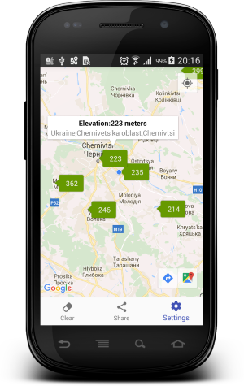
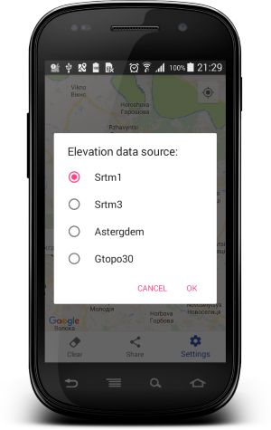

# Elevation

Simple Android App for giving the elevation in meters on map, using geonames API http://www.geonames.org

#### How to use?
 
Click on the right place on the map...

Main Activity|Sources Dialog 
-------------|----------------- 
  |  

#### Elevation sources:
* **Elevation - SRTM1**: sample area: ca 30m x 30m Result : a single number giving the elevation in meters according to srtm1, ocean areas have been masked as "no data" and have been assigned a value of -32768 
* **Elevation - SRTM3**: Shuttle Radar Topography Mission (SRTM) elevation data. SRTM consisted of a specially modified radar system that flew onboard the Space Shuttle Endeavour during an 11-day mission in February of 2000. The dataset covers land areas between 60 degrees north and 56 degrees south.
  This web service is using SRTM3 data with data points located every 3-arc-second (approximately 90 meters) on a latitude/longitude grid.
  Documentation : [cgiar-csi](http://www.cgiar-csi.org/data/srtm-90m-digital-elevation-database-v4-1),[Nasa](http://www2.jpl.nasa.gov/srtm/) 
* **Elevation - Aster Global Digital Elevation Model V1 2009**: sample are: ca 30m x 30m, between 83N and 65S latitude. Result : a single number giving the elevation in meters according to [aster gdem](https://asterweb.jpl.nasa.gov/gdem.asp), ocean areas have been masked as "no data" and have been assigned a value of -9999. ASTER GDEM is a product of METI and NASA. 
* **Elevation - GTOPO30**: GTOPO30 is a global digital elevation model (DEM) with a horizontal grid spacing of 30 arc seconds (approximately 1 kilometer). GTOPO30 was derived from several raster and vector sources of topographic information. Documentation : [USGS Gtopo30](https://eros.usgs.gov/#/Find_Data/Products_and_Data_Available/gtopo30_info) 

The astergdem data has finer resolution, but is not processed. The srtm3v4 data does not have the same resolution as the astergem data, but it is processed. This means holes and data errors have been corrected. 

Developed By
-------
Igor Havrylyuk (Graviton57)

[1]: https://github.com/graviton57/Elevation.git
